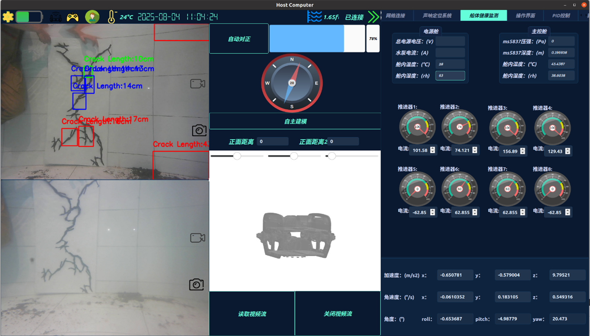
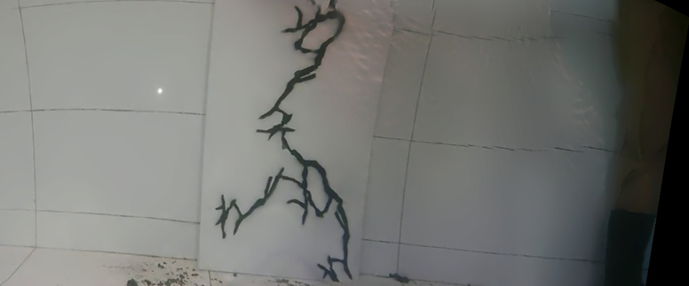

# Host-Computer-GUI-for-Dam2025

# Requirements
*QT5,C++,GCC,QUC(directly integrated into the QT designer interface),OPENCV 4.6.0+,cuda11.x,cudnn,eigen(matrix operation library)*

<table>
  <tr>
    <td width="50%" align="center"> <video src="figs/Image92.mp4" width="100%" controls></video>
       
      <b>Third-person View</b>
    </td>
    <td width="50%" align="center"> <video src="figs/Image91.mp4" width="100%" controls></video>
       
      <b>First-person View</b>
    </td>
  </tr>
</table>

## GUI Stylesheet
You can ask AI to generate a stylesheet corresponding with your theme easily and use setstylesheet function to apply it,which is literally what i do.

## Tcp Communication with Lower-computer
If you've mastered how to use QT to write a simple chat program,you could easily understand the Class **tcpserver** and use it flexibly.

## RTSP for Video Transmission
Referring to the Class **rtsp**,it receives the two streams from OrangePi.(Use [Mediamtx](https://github.com/bluenviron/mediamtx) to push stream in OrangePi)

## Image and Video Saving
Referring to the Class **saver**,it enables you to choose whether to save image and video or not.

## LocalizationMap
The **localizationmap** class shows how to visualize the location of the ROV.Additionally,the class **KalmanFilter** provides an idea to smooth the ROV location but i didn't use it in the contest this year given that it is not that mature.

## Image Stitching
Please carefully **learn the [stitching_detailed](https://docs.opencv.org/4.6.0/d9/dd8/samples_2cpp_2stitching_detailed_8cpp-example.html) example in OPENCV official website first**.Then you can understand the class **stitcher** in this program.If you intend to improve it further,you can refer to [this](https://github.com/ziqiguo/CS205-ImageStitching).
<table width="100%"> <tr>
    <td align="center">
      <video src="figs/Image74.mp4" width="100%" controls></video>
       
      <b>Step 1: Stitching Process</b> </td>
  </tr>
  
  <tr>
    <td align="center">
      
       
      <b>Step 2: Stitched Result</b> </td>
  </tr>
</table>

## Real-time Rov 3D Position Display

Referring to the **_3d** class,modify the **3d.qml** as needed(.obj ROV model path).Here is an example ROV model [澜巡智卫](https://www.alipan.com/s/f3p4jHjJv4x) 提取码：**50od**.

<table width="100%">
  <tr>
    <td align="center" width="50%">
      <video src="figs/Image89.mp4" width="100%" controls></video>
       
      <b>潜航过门</b>
    </td>
    <td align="center" width="50%">
      <video src="figs/Image90.mp4" width="100%" controls></video>  
      <b>子弹运动</b>
    </td>
  </tr>

  <tr>
    <td align="center" width="50%">
      <video src="figs/Image88.mp4" width="100%" controls></video>
       
      <b>绕桩</b>
    </td>
    <td align="center" width="50%">
      <video src="figs/Image87.mp4" width="100%" controls></video>
       
      <b>姿态自稳</b>
    </td>
  </tr>
</table>

## License

[MIT](https://choosealicense.com/licenses/mit/)
